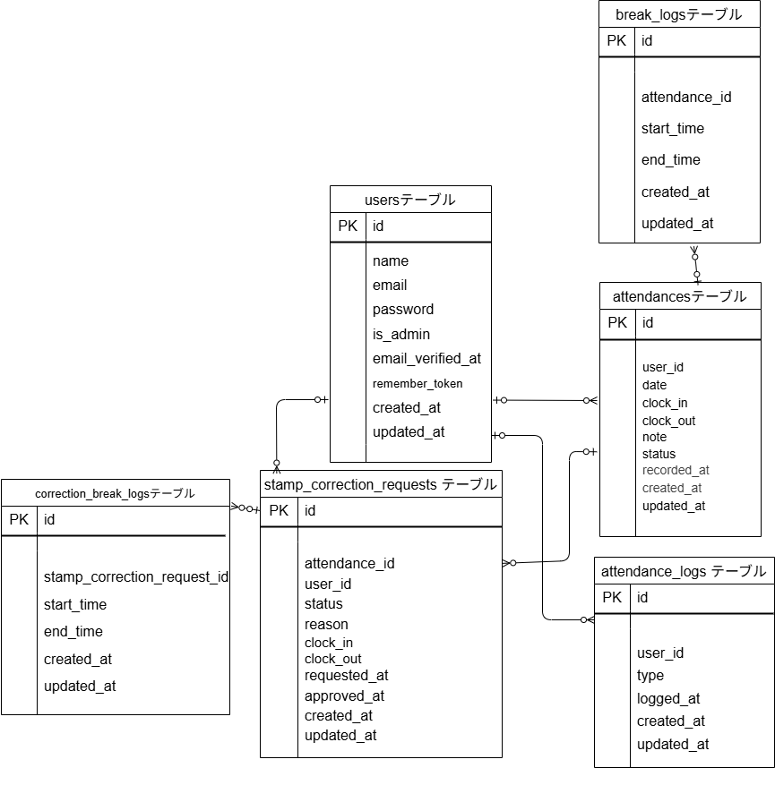

# 勤怠管理アプリ
## 環境構築
**Dockerビルド**
1. リポジトリをクローン
``` bash
git clone git@github.com:koto-101/mitani-mockcase-2.git
```
2. ディレクトリを移動
``` bash
cd mitani-mockcase-2
```
3. DockerDesktopアプリを立ち上げる
``` bash
docker-compose up -d --build
```

**Laravel環境構築**
1. PHPコンテナに入る
``` bash
docker-compose exec php bash
```
2. パッケージインストール
``` bash
composer install
```
3. ディレクトリを移動
``` bash
cd src/
```
4. .env ファイル作成
``` bash
cp .env.example .env
```
5. .env に以下のDB、メール設定を記述
#### データベース設定
``` text
DB_CONNECTION=mysql
DB_HOST=mysql
DB_PORT=3306
DB_DATABASE=laravel_db
DB_USERNAME=laravel_user
DB_PASSWORD=laravel_pass

```
#### メール設定
``` text
MAIL_FROM_ADDRESS=no-reply@example.com

```
6. アプリケーションキーの作成
``` bash
php artisan key:generate
```
7. 設定キャッシュ（環境変数変更時は都度推奨） 
``` bash 
php artisan config:cache
```
8. マイグレーションの実行
``` bash
php artisan migrate
```

9. シーディングの実行
``` bash
php artisan db:seed
```

## テーブル仕様
### usersテーブル
| カラム名                | 型           | PRIMARY KEY | UNIQUE KEY | NOT NULL | FOREIGN KEY |
| ------------------- | ----------- | ----------- | ---------- | -------- | ----------- |
| id                  | id          | ○           |            | ○        |             |
| name                | string      |             |            | ○        |             |
| email               | string      |             | ○          | ○        |             |
| password            | string      |             |            | ○        |             |
| is\_admin           | boolean     |             |            | ○        |             |
| email\_verified\_at | timestamp   |             |            |          |             |
| remember\_token     | string(100) |             |            |          |             |
| created\_at         | timestamp   |             |            |          |             |
| updated\_at         | timestamp   |             |            |          |             |

### attendances テーブル
| カラム名         | 型               | PRIMARY KEY | UNIQUE KEY | NOT NULL | FOREIGN KEY |
| ------------ | --------------- | ----------- | ---------- | -------- | ----------- |
| id           | id              | ○           |            | ○        |             |
| user\_id     | unsigned bigint |             |            | ○        | users(id)   |
| date         | date            |             |            | ○        |             |
| clock\_in    | datetime        |             |            |          |             |
| clock\_out   | datetime        |             |            |          |             |
| note         | text            |             |            |          |             |
| status       | string          |             |            |          |             |
| recorded\_at | datetime        |             |            |          |             |
| created\_at  | timestamp       |             |            |          |             |
| updated\_at  | timestamp       |             |            |          |             |

### stamp_correction_requests テーブル
| カラム名           | 型               | PRIMARY KEY | UNIQUE KEY | NOT NULL | FOREIGN KEY                 |
| -------------- | --------------- | ----------- | ---------- | -------- | --------------------------- |
| id             | id              | ○           |            | ○        |                             |
| attendance\_id | unsigned bigint |             |            | ○        | attendances(id)             |
| user\_id       | unsigned bigint |             |            | ○        | users(id)                   |
| status         | enum            |             |            | ○        | pending, approved, rejected |
| reason         | text            |             |            | ○        |                             |
| clock\_in      | time            |             |            | ○        |                             |
| clock\_out     | time            |             |            |          |                             |
| requested\_at  | timestamp       |             |            | ○        |                             |
| approved\_at   | timestamp       |             |            | ○        |                             |
| created\_at    | timestamp       |             |            |          |                             |
| updated\_at    | timestamp       |             |            |          |                             |

### attendance_logs テーブル
| カラム名        | 型               | PRIMARY KEY | UNIQUE KEY | NOT NULL | FOREIGN KEY                                  |
| ----------- | --------------- | ----------- | ---------- | -------- | -------------------------------------------- |
| id          | id              | ○           |            | ○        |                                              |
| user\_id    | unsigned bigint |             |            | ○        | users(id)                                    |
| type        | enum            |             |            | ○        | clock\_in, clock\_out, break\_in, break\_out |
| logged\_at  | datetime        |             |            | ○        |                                              |
| created\_at | timestamp       |             |            |          |                                              |
| updated\_at | timestamp       |             |            |          |                                              |

### correction_break_logs テーブル
| カラム名                           | 型               | PRIMARY KEY | UNIQUE KEY | NOT NULL | FOREIGN KEY                     |
| ------------------------------ | --------------- | ----------- | ---------- | -------- | ------------------------------- |
| id                             | id              | ○           |            | ○        |                                 |
| stamp\_correction\_request\_id | unsigned bigint |             |            | ○        | stamp\_correction\_requests(id) |
| start\_time                    | time            |             |            |          |                                 |
| end\_time                      | time            |             |            |          |                                 |
| created\_at                    | timestamp       |             |            |          |                                 |
| updated\_at                    | timestamp       |             |            |          |                                 |

### break_logs テーブル
| カラム名           | 型               | PRIMARY KEY | UNIQUE KEY | NOT NULL | FOREIGN KEY     |
| -------------- | --------------- | ----------- | ---------- | -------- | --------------- |
| id             | id              | ○           |            | ○        |                 |
| attendance\_id | unsigned bigint |             |            | ○        | attendances(id) |
| start\_time    | datetime        |             |            | ○        |                 |
| end\_time      | datetime        |             |            |          |                 |
| created\_at    | timestamp       |             |            |          |                 |
| updated\_at    | timestamp       |             |            |          |                 |


## ER図


## URL一覧

### ログイン画面
- 一般ユーザー用：<http://localhost/login>
- 管理者ユーザー用：<http://localhost/admin/login>

### 開発用ツール
- phpMyAdmin（DB確認）：<http://localhost:8080>
- Mailhog（メール確認）：<http://localhost:8025>

## 使用技術(実行環境)
- **OS**: Windows 11
- **言語・フレームワーク**
- PHP 8.1
- Laravel 8.83.29 (LTS)
- **認証**: Laravel Fortify
- **バリデーション**: FormRequest
- **メール送信確認**: Mailhog
- **開発補助**:
  - Docker / Docker Compose

## テストアカウント一覧

| 名前     | メールアドレス         | パスワード   |
|----------|------------------------|--------------|
| 一般1    | user1@example.com      | user1234     |
| 一般2    | user2@example.com      | user1234     |
| 管理者1  | admin1@example.com     | admin1234    |
| 管理者2  | admin2@example.com     | admin1234    |

## テストについて
1. テスト用データベースの作成
```bash
docker-compose exec mysql bash
mysql -u root -p
# パスワードは「root」と入力
create database demo_test;
```
2. ユーザー権限を付与
次に、laravel_user ユーザーに対してdemo_test への権限を付与します：
```bash
GRANT ALL PRIVILEGES ON demo_test.* TO 'laravel_user'@'%';
FLUSH PRIVILEGES;
```
3. .env.testing の作成
```bash
cp .env .env.testing
```
4. .env.testing に以下のDB設定を記述
``` text
DB_DATABASE=demo_test
```
5. キャッシュをクリア
```bash
docker-compose exec php bash
php artisan cache:clear
php artisan config:clear
```
6. テスト用マイグレーションを実行
```bash
php artisan migrate:fresh --env=testing
```
7. テストの実行
```bash
php artisan test
```
## キャッシュのクリア
手順通りに実行していただいてもphpMyAdminでDBやテーブルの確認ができないことがあります。
以下のコマンドを実行してキャッシュをクリアし、再度マイグレーションを試してみてください。
```bash
php artisan cache:clear
php artisan config:clear
```
## 仕様の不明点について
以前、コーチを通して不明点を質問させていただきましたが、回答に時間がかかっていたため、コーチに確認の上、こちらの判断で実装させていただいております。
以下、質問と、それに対する実装点をまとめましたのでご確認いただきますようお願いいたします。

1. 質問1 バリデーションメッセージの矛盾点について

※以下の記載において、
A：LMSのタスク管理に記載された内容
B：案件シートの機能要件
C：案件シートのテストケース一覧
をそれぞれ指します。

■ 矛盾①：出勤・退勤時間の比較条件

Aの定義：
　「出勤時間が退勤時間より後」または「退勤時間が出勤時間より後」
　→ ※後半の条件は正常な状態であり、記述として矛盾があるように見受けられました。

B / Cの定義：
　「出勤時間が退勤時間より後」または「退勤時間が出勤時間より前」
　→ こちらは適切な条件設定と判断しております。

■ 矛盾②：休憩時間が勤務時間外の場合の文言の違い

Aの文言：
　「休憩開始時間および終了時間が出勤時間および退勤時間を超えている」場合
　→ エラーメッセージ：「休憩時間が勤務時間外です」

Bの文言：
　- 休憩開始が出勤時間より前または退勤時間より後 → 「休憩時間が不適切な値です」
　- 休憩終了が退勤時間より後 → 「休憩時間もしくは退勤時間が不適切な値です」

Cの文言：
　- 休憩開始が退勤時間より後 → 「休憩時間が不適切な値です」
　- 休憩終了が退勤時間より後 → 「休憩時間もしくは退勤時間が不適切な値です」

■ 矛盾③：休憩終了時間が退勤時間より後の場合のエラーメッセージ

B / Cの定義：
　休憩終了が退勤時間より後の場合 → 「休憩時間もしくは退勤時間が不適切な値です」

Aの定義：
　休憩開始と終了の条件をまとめて一つのエラーとして表示
　→ 「休憩時間が勤務時間外です」

❖ 上記の不整合への対応（実装内容）

バリデーションメッセージの実装にあたっては、原則としてテストケース（C）に準拠しつつ、
一部Cに記載がない仕様については、案件シート（B）の定義内容を参考に補完しております。

また、CとBで表現に差異がある場合には、より具体的でユーザーに伝わりやすい文言（例：「出勤時間が不適切な値です」など）を優先して使用するようにしております。

2. 質問2　修正申請に関する仕様について 
以下について、要件定義に明記がなく判断が難しいため、仕様確認をお願いいたします。
 ① 修正申請後の再申請可否 修正申請後、承認された後も、再度修正申請が可能という理解でよろしいでしょうか？ あるいは、一度修正が完了したものについては、その後の修正・申請は不可となる仕様でしょうか？
  ➡︎ 管理者・一般ユーザーともに、一度修正が完了した後でも、再度修正申請が可能な仕様としております。
 
② 「承認待ち」状態における休憩欄の表示 「承認待ちのため修正はできません」と表示されている状態の画面において、 休憩2（＝休憩回数＋1のブランク欄）は表示しておく必要がありますでしょうか？ Figma上では、該当画面のみ休憩2欄が表示されていなかったため、意図的な非表示か、表示漏れかの判断がつかない状況です。
  ➡他の画面では休憩２欄が表示されていたため、本画面でも表示するよう実装しております。